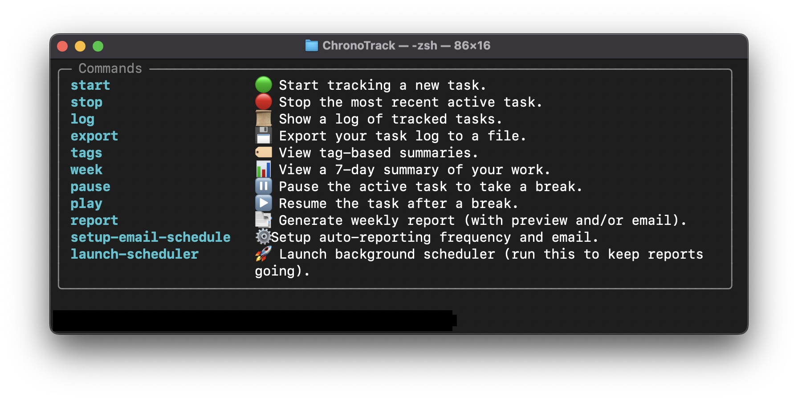
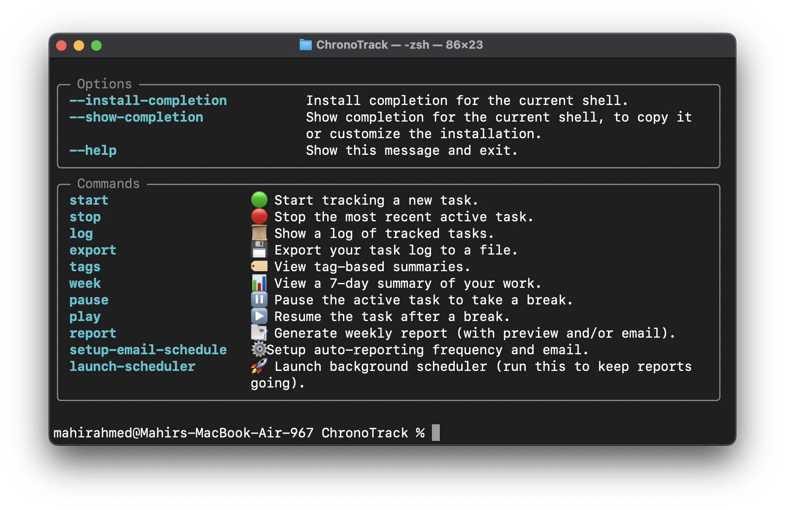
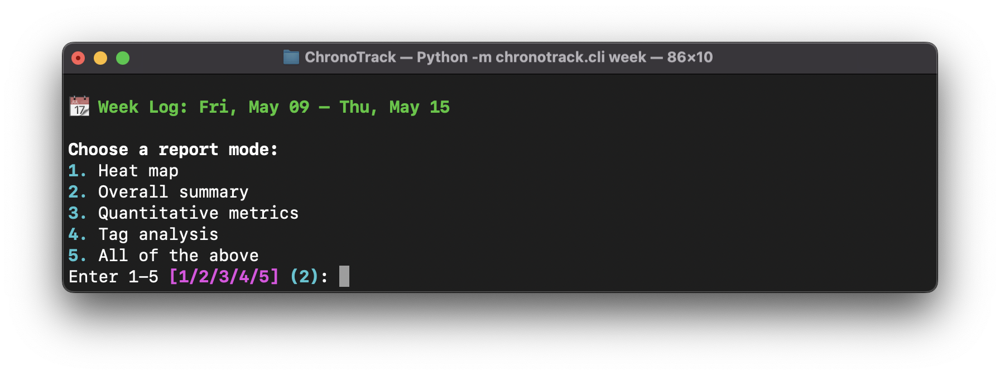
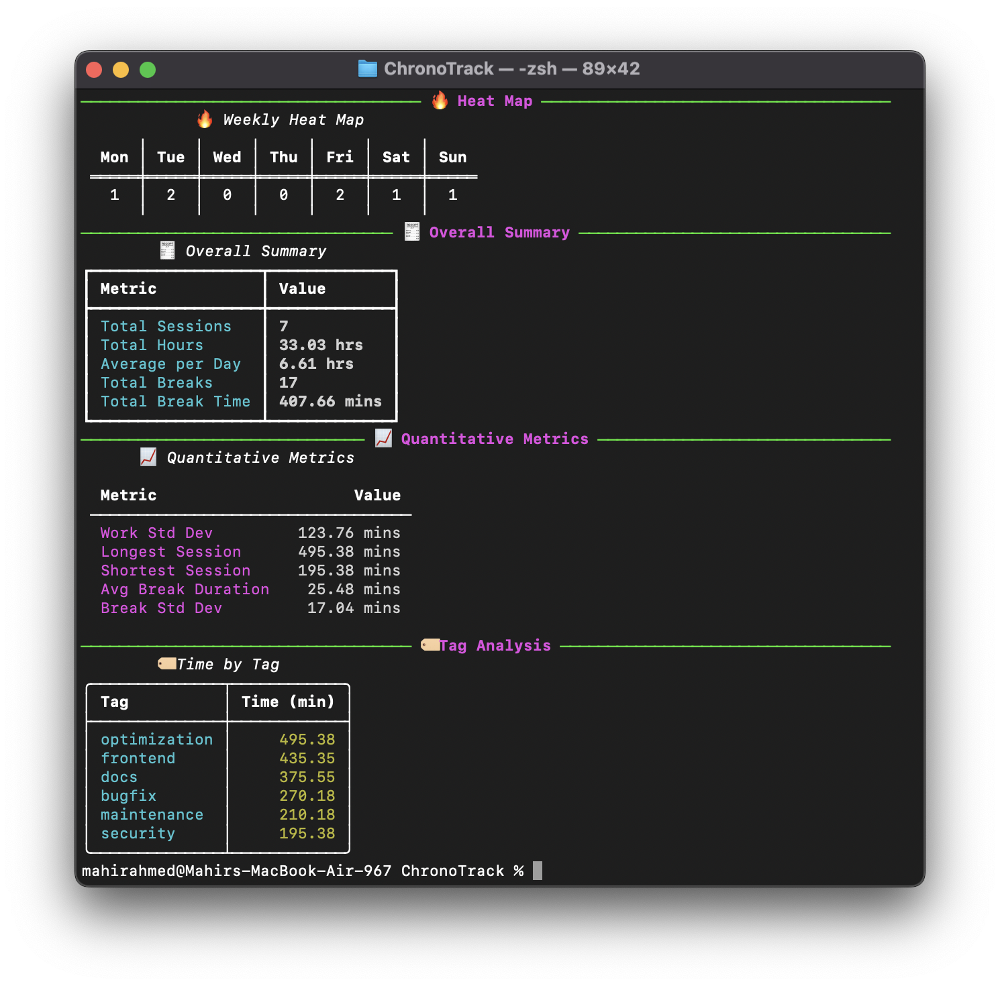

# ⏱️ ChronoTrack

<div align="left">

[](https://www.python.org/)
[](LICENSE)
[](https://github.com/yourusername/ChronoTrack)
[](https://pypi.org/project/chronotrack/)
[](https://pypi.org/project/chronotrack/)

</div>

> **A lightweight yet powerful CLI-based time tracker engineered for developers and creators. Log your work sessions, breaks, categorize with tags, and analyze productivity patterns—all from your terminal.**

---

## 📋 Table of Contents

- [Features](#-features)
- [Installation](#-installation)
- [Quick Start](#-quick-start)
- [Command Reference](#-command-reference)
- [Usage Examples](#-usage-examples)
- [Productivity Reports](#-productivity-reports)
- [Data Management](#-data-management)
- [Customization](#-customization)
- [Philosophy](#-philosophy)
- [Technical Details](#-technical-details)
- [Contributing](#-contributing)
- [License](#-license)
- [Acknowledgements](#-acknowledgements)

---

## 🚀 Features

<div align="center">



</div>

- **🟢 Session Management** - Start, stop, pause, and resume work sessions with precision
- **⏱️ Break Tracking** - Automatically track break durations for better work/rest balancing
- **🏷️ Tagging System** - Categorize your work with customizable tags for detailed reporting
- **📊 Analytics** - Visualize productivity patterns with built-in statistics and charts
- **📝 Session Notes** - Document context, achievements, and thoughts for each session
- **📈 Weekly Reports** - Get insights into your productivity with comprehensive weekly summaries
- **🔄 Flexible Exports** - Export your data to JSON or CSV for external analysis
- **🎨 Rich Terminal UI** - Enjoy a visually appealing interface with color-coding and formatting
- **⚡ Performance** - Minimal resource usage with lightning-fast command execution
- **🔒 Privacy-Focused** - All data stays local on your machine, no cloud sync required

---

## 📦 Installation

### Via PyPI (Recommended)

```bash
pip install chronotrack
```

### Via Conda

```bash
conda install -c conda-forge chronotrack
```

### From Source

```bash
git clone https://github.com/yourusername/ChronoTrack.git
cd ChronoTrack
pip install -e .
```

### System Requirements

- Python 3.8+
- 5MB disk space
- Linux, macOS, or Windows

---

## 🚀 Quick Start

### 1. Start tracking a task:

```bash
chronotrack start "Implement authentication module" backend
```

### 2. Take a break:

```bash
chronotrack pause
```

### 3. Resume work:

```bash
chronotrack play
```

### 4. Finish your session:

```bash
chronotrack stop "Completed user auth flow implementation"
```

### 5. View your day's progress:

```bash
chronotrack log today
```

---

## 💻 Command Reference

<div align="center">



</div>


---

## 🧪 Usage Examples

### Basic Workflow

```bash
# Start a coding session
chronotrack start "Refactor database models" database

# Take a quick break
chronotrack pause

# Resume coding
chronotrack play

# End session with a note
chronotrack stop "Completed normalization of user table"
```

### Viewing Your Progress

```bash
# See today's work
chronotrack log today

# Get weekly report
chronotrack week

# Analyze all sessions with the "frontend" tag
chronotrack log --tag frontend
```

### Managing Data

```bash
# Export to JSON
chronotrack export json

# Export to CSV with custom filename
chronotrack export csv --output my_productivity_data.csv

# Cancel a session (if you started by mistake)
chronotrack cancel
```

---

## 📊 Productivity Reports

ChronoTrack provides powerful insights into your work patterns:

```bash
chronotrack week
```

You'll see a detailed report that includes:

- **Daily breakdown** of work hours
- **Efficiency metrics** showing focus time vs. break time
- **Tag distribution** showing where your time is allocated
- **Productivity trends** with standard deviation analysis
- **Break pattern analysis** for optimal rest scheduling
- **Comparative view** against your historical averages

### Report Options

<div align="center">



</div>

Customize your reports with various options:

```bash
chronotrack week --chart          # Include visualization charts
chronotrack week --format compact # Condensed view for quick insights
chronotrack week --compare last   # Compare with previous week
```

### Report Example

<div align="center">



</div>

---

## 💾 Data Management

### Data Storage

ChronoTrack stores your session data in a simple, human-readable JSON file:

```
~/.chronotrack/session_log.json
```

### Data Format

Each session is stored in the following structure:

```json
{
  "task": "Write blog post",
  "tag": "writing",
  "start": "2025-05-13T12:30:00",
  "end": "2025-05-13T13:45:00",
  "duration_minutes": 65.0,
  "breaks": [
    {"start": "2025-05-13T13:00:00", "end": "2025-05-13T13:05:00", "duration_minutes": 5.0}
  ],
  "total_breaks": 1,
  "total_break_time": 5.0,
  "note": "Felt very focused",
  "note_added": true
}
```

### Exporting Data

Export your data for external analysis:

```bash
# Export to JSON
chronotrack export json

# Export to CSV
chronotrack export csv

# Specify custom output location
chronotrack export json --output ~/Documents/productivity_data.json
```

### Backup Recommendations

- Create periodic backups of your `session_log.json` file
- Consider version control for your productivity data
- Use the export functionality before major updates

---

## ⚙️ Customization

### Configuration File

Customize ChronoTrack behavior by creating a `~/.chronotrack/config.yaml` file:

```yaml
# Default tag when none is specified
default_tag: "general"

# Custom color scheme
colors:
  active: "green"
  paused: "yellow"
  stopped: "red"
  
# Auto-pause after inactivity (minutes)
auto_pause: 15

# Default report format
default_report: "detailed"
```

### Environment Variables

Configure behavior with environment variables:

```bash
# Set data directory
export CHRONOTRACK_DATA_DIR="/path/to/data"

# Enable debug mode
export CHRONOTRACK_DEBUG=1
```

---

## 🧠 Philosophy

ChronoTrack is built on several core principles:

1. **Terminal-First** - For developers who live in the command line
2. **Minimal Friction** - Track time without disrupting your workflow
3. **Data Ownership** - Your productivity data stays on your machine
4. **Insightful Analytics** - Measure to improve your work patterns
5. **Extensibility** - Simple data format for easy integration

ChronoTrack is designed for:
- **Developers** who prefer keyboard-driven tools
- **Writers & content creators** tracking creative output
- **Consultants & freelancers** who need accurate time logs
- **Students** managing study sessions and breaks
- Anyone seeking **actionable productivity insights**

---

## 🔧 Technical Details

### Project Structure

```
chronotrack/
├── cli.py          # CLI commands using Typer
├── tracker.py      # Core session logic
├── utils.py        # Shared helpers
├── __init__.py     # Versioning & packaging
├── session_log.json (autogenerated)
```


### Best Practices

- Always **stop** a session before starting a new one
- Use **consistent tag names** for better reporting
- Add **detailed notes** for context when stopping a session
- Run **weekly reports** to identify productivity patterns
- Export data **regularly** for safekeeping

---

## 🛠 Contributing

We welcome contributions from the community! Here's how to get started:

### Development Setup

```bash
git clone https://github.com/yourusername/ChronoTrack.git
cd ChronoTrack
python -m venv venv
source venv/bin/activate  # On Windows: venv\Scripts\activate
pip install -e ".[dev]"
```

### Running Tests

```bash
pytest tests/
```


### Pull Request Process

1. Fork the repository
2. Create a feature branch (`git checkout -b feature/amazing-feature`)
3. Make your changes
4. Run tests and linting
5. Commit your changes (`git commit -m 'Add amazing feature'`)
6. Push to your branch (`git push origin feature/amazing-feature`)
7. Open a Pull Request

Please include tests and documentation with your PR.

---

## 📄 License

ChronoTrack is licensed under the MIT License. See the [LICENSE](LICENSE) file for details.

```
MIT License

Copyright (c) 2025 Your Name

Permission is hereby granted, free of charge, to any person obtaining a copy
of this software and associated documentation files...
```

---

## 🙌 Acknowledgements

- [Typer](https://github.com/tiangolo/typer) for the elegant CLI framework
- [Rich](https://github.com/Textualize/rich) for beautiful terminal rendering
- You, for choosing ChronoTrack to boost your productivity

---

<div align="center">

> "You can't manage what you don't measure." — Peter Drucker

**[Website](https://chronotrack.dev) • [Documentation](https://docs.chronotrack.dev) • [GitHub](https://github.com/yourusername/ChronoTrack) • [Issues](https://github.com/yourusername/ChronoTrack/issues)**

</div>